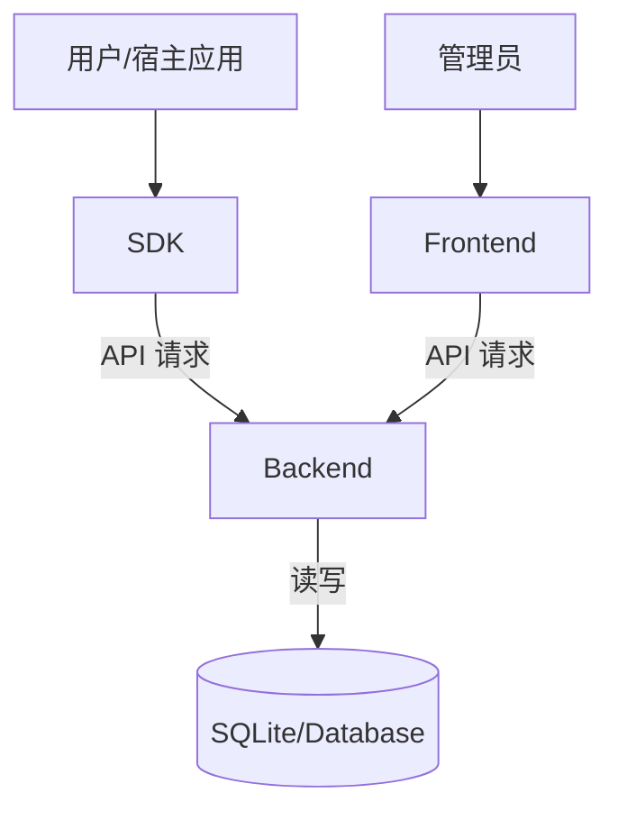

# 系统架构文档

## 1. 整体架构

Product Studio 是一个全栈用户引导系统解决方案，采用前后端分离的 Monorepo 架构。系统由三个核心部分组成：

1.  **SDK (`/sdk`)**: 嵌入宿主应用的 JavaScript 库，负责展示引导内容和提供可视化配置能力。
2.  **前端管理平台 (`/frontend`)**: 基于 React 的 Web 应用，用于应用注册、配置管理和数据查看。
3.  **后端服务 (`/backend`)**: 基于 Node.js 的 RESTful API 服务，负责数据存储、版本管理和权限控制。

### 组件关系图

## 2. 数据流图

### 2.1 配置加载流程
1. SDK 初始化 (`init({ appId })`)。
2. SDK 向 Backend 发起 `GET /api/config/:appId` 请求。
3. Backend 查询数据库中该 App 的最新激活配置。
4. Backend 返回配置 JSON。
5. SDK 根据配置渲染引导组件或 Banner。

### 2.2 配置保存流程 (编辑模式)
1. 用户在宿主应用中通过 SDK 的编辑面板进行操作。
2. 点击 "Save" 按钮。
3. SDK 向 Backend 发起 `POST /api/config/:appId` 请求。
4. Backend 将新配置作为新版本存入数据库。
5. Backend 返回成功响应。

## 3. 技术选型

### SDK
- **Core**: React 18 (用于 UI 渲染), TypeScript
- **Build**: Vite (打包为 ESM/UMD)
- **Styling**: Styled Components (实现样式隔离)

### Frontend
- **Framework**: React 18, Vite
- **UI Library**: Ant Design 5
- **Network**: Axios
- **Router**: React Router 6

### Backend
- **Runtime**: Node.js
- **Framework**: Express
- **ORM**: Prisma
- **Database**: SQLite (开发环境), PostgreSQL/MySQL (生产环境支持)

## 4. 模块职责边界

| 模块 | 职责 | 接口规范 |
|------|------|----------|
| **SDK** | 元素选择、引导渲染、配置编辑 UI、与后端通信 | `init(config)`, UI Overlay |
| **Frontend** | 应用生命周期管理、接入指引、全局设置 | Web UI |
| **Backend** | API 提供、数据持久化、业务逻辑处理 | RESTful API |

## 5. 版本控制与分支管理

- **主分支 (main)**: 保持随时可发布状态。
- **开发分支 (develop)**: 日常开发合并的目标分支。
- **特性分支 (feature/*)**: 从 develop 切出，开发完成后合并回 develop。
- **发布策略**: 采用 Semantic Versioning (SemVer)。
